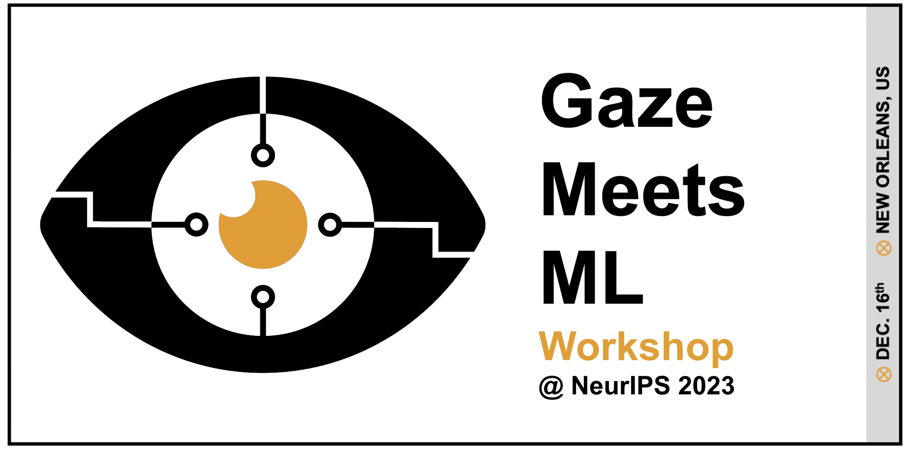

     

We are excited to host the 2nd edition of the Gaze Meets ML workshop in conjunction with NeurIPS 2023 in **December, 2023**. *The workshop will take place in-person at New Orleans! Looking forward to seeing you in person!*

This year we are continuing to have a great lineup of [speakers](https://gaze-meets-ml.github.io/gaze_ml_2023/speakers/). We would like to thank our [sponsors](https://gaze-meets-ml.github.io/gaze_ml_2023/sponsors/) for their support. If you are interested in sponsoring, please find more information [here](https://gaze-meets-ml.github.io/gaze_ml_2023/call_for_sponsors/).

For questions and further information, please reach out to [gaze.neurips@gmail.com](mailto:gaze.neurips@gmail.com).

 <a href="https://twitter.com/Gaze_Meets_ML">@Gaze_Meets_ML</a>

# About

Eye gaze has proven to be a cost-efficient way to collect large-scale physiological data that can reveal the underlying
human attentional patterns in real-life workflows, and thus has long been explored as a signal to directly measure
human-related cognition in various domains. Physiological data (including but not limited to eye gaze) offer new
perception capabilities, which could be used in several ML domains, e.g., egocentric perception, embodied AI, NLP, etc.
They can help infer human perception, intentions, beliefs, goals, and other cognition properties that are much needed for
human-AI interactions and agent coordination. In addition, large collections of eye-tracking data have enabled
data-driven modeling of human visual attention mechanisms, both for saliency or scanpath prediction, with twofold
advantages: from the neuroscientific perspective to understand biological mechanisms better, from the AI perspective to
equip agents with the ability to mimic or predict human behavior and improve interpretability and interactions.

With the emergence of immersive technologies, now more than any time there is a need for experts of various backgrounds
(e.g., machine learning, vision, and neuroscience communities) to share expertise and contribute to a deeper
understanding of the intricacies of cost-efficient human supervision signals (e.g., eye-gaze) and their utilization
towards by bridging human cognition and AI in machine learning research and development. The goal of this workshop is to
bring together an active research community to collectively drive progress in defining and addressing core problems in
gaze-assisted machine learning.

For past Gaze Meets ML workshop, visit <a href="https://gaze-meets-ml.github.io/gaze_ml_2022/">Gaze Meets ML 2022.</a>

 

# Workshop Schedule
All times are in Central Time

<table class="tg">
<thead>
  <tr>
    <th class="tg-av16">Sat 7:30 a.m. - 8:15 a.m.</th>
    <th class="tg-ndde">Meet and Greet and Getting started(Break)</th>
    <th class="tg-bd63"></th>
  </tr>
</thead>
<tbody>
  <tr>
    <td class="tg-1rwr"> Sat 8:15 a.m. - 8:30 a.m.</td>
    <td class="tg-w1dh">Opening Remarks (15 mins) Organizers (Opening Remarks)</td>
    <td class="tg-bd63"></td>
  </tr>
  <tr>
    <td class="tg-1rwr"> Sat 8:30 a.m. - 9:15 a.m.</td>
    <td class="tg-ndde"><a href="https://neurips.cc/virtual/2023/78823" target="_blank" rel="noopener noreferrer">Invited Talk TBD</a><a href="https://neurips.cc/virtual/2023/78823" target="_blank" rel="noopener noreferrer">
    <td class="tg-bd63">Bertram Shi</td>
  </tr>
  <tr>
    <td class="tg-1rwr"> Sat 9:15 a.m. - 10:00 a.m.</td>
    <td class="tg-ndde"><a href="https://neurips.cc/virtual/2023/78824" target="_blank" rel="noopener noreferrer">Invited Talk</a><a href="https://neurips.cc/virtual/2023/78824" target="_blank" rel="noopener noreferrer">
    <td class="tg-bd63">Vidhya Navalpakkam</td>
  </tr>
  <tr>
    <td class="tg-1rwr"> Sat 10:00 a.m. - 10:30 a.m.</td>
    <td class="tg-w1dh">Coffee Break (Coffee Break and Poster Walk-Around)</td>
    <td class="tg-bd63"></td>
  </tr
  <tr>
    <td class="tg-1rwr"> Sat 10:30 a.m. - 10:45 a.m.</td>
    <td class="tg-ndde"><a href="https://neurips.cc/virtual/2023/75498" target="_blank" rel="noopener noreferrer">Interaction-aware Dynamic 3D Gaze Estimation in Videos </a>(Spotlight)</td>
    <td class="tg-bd63">Chenyi Kuang · Jeffrey O Kephart · Qiang Ji</td>
  </tr>
  <tr>
    <td class="tg-1rwr"> Sat 10:45 a.m. - 11:00 a.m.</td>
    <td class="tg-ndde"><a href="https://neurips.cc/virtual/2023/75499" target="_blank" rel="noopener noreferrer">SuperVision: Self-Supervised Super-Resolution for Appearance-Based Gaze Estimation</a>(Spotlight)</td>
    <td class="tg-bd63">Galen O'Shea · Majid Komeili</td>
  </tr>
  <tr>
    <td class="tg-1rwr"> Sat 11:00 a.m. - 11:15 a.m.</td>
    <td class="tg-ndde"><a href="https://neurips.cc/virtual/2023/75501" target="_blank" rel="noopener noreferrer">EG-SIF: Improving Appearance Based Gaze Estimation using Self Improving Features</a>(Spotlight)</td>
    <td class="tg-bd63">Vasudev Singh · Chaitanya Langde · Sourav Lakhotia · Vignesh Kannan · Shuaib Ahmed</td>
  </tr>
  <tr>
    <td class="tg-1rwr"> Sat 11:15 a.m. - 11:30 a.m.</td>
    <td class="tg-ndde"><a href="https://neurips.cc/virtual/2023/75502" target="_blank" rel="noopener noreferrer">Planning by Active Sensing</a>(Spotlight)</td>
    <td class="tg-bd63">Kaushik Lakshminarasimhan · Seren Zhu · Dora Angelaki</td>
  </tr>
    <tr>
    <td class="tg-1rwr"> Sat 11:30 a.m. - 11:45 a.m.</td>
    <td class="tg-ndde"><a href="https://neurips.cc/virtual/2023/75503" target="_blank" rel="noopener noreferrer">Crafting Good Views of Medical Images for Contrastive Learning via Expert-level Visual Attention</a>(Spotlight)</td>
    <td class="tg-bd63">Sheng Wang · Zihao Zhao · Lichi Zhang · Dinggang Shen · Qian Wang</td>
  </tr>
  <tr>
    <td class="tg-1rwr"> Sat 11:45 a.m. - 1:30 p.m.</td>
    <td class="tg-w1dh">Lunch (Lunch and Poster Walk-Around)</td>
    <td class="tg-bd63"></td>
  </tr>
  <tr>
    <td class="tg-1rwr"> Sat 1:30 p.m. - 2:15 p.m.</td>
    <td class="tg-ndde"><a href="https://neurips.cc/virtual/2023/79300" target="_blank" rel="noopener noreferrer">Invited Talk</a><a href="https://neurips.cc/virtual/2023/79300" target="_blank" rel="noopener noreferrer">
    <td class="tg-bd63">Tim Roff</td>
  </tr>
  <tr>
    <td class="tg-1rwr"> Sat 2:15 p.m. - 2:30 p.m.</td>
    <td class="tg-ndde"><a href="https://neurips.cc/virtual/2023/75504" target="_blank" rel="noopener noreferrer">Memory-Based Sequential Attention</a>(Spotlight)</td>
    <td class="tg-bd63"> Jason Stock · Charles Anderson</td>
  </tr>
  <tr>
    <td class="tg-1rwr"> Sat 2:30 p.m. - 2:45 p.m.</td>
    <td class="tg-ndde"><a href="https://neurips.cc/virtual/2023/75500" target="_blank" rel="noopener noreferrer">An Attention-based Predictive Agent for Handwritten Numeral/Alphabet Recognition via Generation</a>(Spotlight)</td>
    <td class="tg-bd63">Bonny Banerjee · Murchana Baruah</td>
  </tr>
  <tr>
    <td class="tg-1rwr"> Sat 2:45 p.m. - 4:30 p.m.</td>
    <td class="tg-w1dh">Breakout session (Discussion within onsite small groups on preselected themes)</td>
    <td class="tg-bd63"></td>
  </tr>
  <tr>
    <td class="tg-1rwr"> Sat 3:00 p.m. - 3:30 p.m.</td>
    <td class="tg-w1dh">Coffee break (Break)</td>
    <td class="tg-bd63"></td>
  </tr>
  <tr>
    <td class="tg-1rwr"> Sat 4:30 p.m. - 4:45 p.m.</td>
    <td class="tg-w1dh">Wrap Up - Sponsors Talk and Award Ceremony</td>
    <td class="tg-0lax"></td>
  </tr>
  <tr>
    <td class="tg-1rwr"> Sat 4:45 p.m. - 5:00 p.m.</td>
    <td class="tg-w1dh">Wrap Up - Closing Remarks (Closing)</td>
    <td class="tg-0lax"></td>
  </tr>
</tbody>
</table>

        
<!--
# Tentative Program
<ul>
    <li>Morning session (225 mins):
        <ul>
            <li>Opening Remarks (15 minutes)</li>
            <li>Keynote (45 mins)</li>
            <li>Invited talks (3x30min = 90 mins) </li>
            <li>Break (15 mins)</li>
            <li>Papers Presentation (60 mins)</li>
        </ul>
    </li>
    <li>Lunch (60 mins):
        <ul>
            <li>60 mins with a walk around poster session</li>
        </ul>
    </li>
    <li> Afternoon session (175 mins):
        <ul>
            <li>Invited talks (1x30 = 30 mins) </li>
            <li>Coffee Break (15 mins)</li>
            <li>Breakout Session (90 mins)</li>
            <li>Papers Presentation (60 mins) </li>
            <li>Closing Remarks (10 mins)</li>
        </ul>
    </li>
</ul> -->

# Call for Papers

We welcome submissions that present aspects of eye gaze in regard to cognitive science, psychophysiology, and computer
science or propose methods for integrating eye gaze into machine learning. We are also looking for applications from radiology, AR/VR,
autonomous driving, etc. that introduce methods and models utilizing eye gaze technology in their respective domains.

Topics of interest include but are not limited to the following:

<ul>
    <li>Understanding the neuroscience of eye-gaze and perception</li>
    <li>State of the art in incorporating machine learning and eye-tracking</li>
    <li>Annotation and ML supervision with eye-gaze</li>
    <li>Attention mechanisms and their correlation with eye-gaze</li>
    <li>Methods for gaze estimation and prediction using machine learning</li>
    <li>Unsupervised ML using eye gaze information for feature importance/selection</li>
    <li>Understanding human intention and goal inference</li>
    <li>Using saccadic vision for ML applications</li>
    <li>Use of gaze for human-AI interaction and agent coordination in multi-agent environments</li>
    <li>Eye gaze used for AI, e.g., NLP, Computer Vision, RL, Explainable AI, Embodied AI, Trustworthy AI </li>
    <li>Ethics of Eye Gaze in AI</li>
    <li>Gaze applications in cognitive psychology, radiology, neuroscience, AR/VR, autonomous cars, privacy, etc.</li>
</ul>

# Important Dates

<ul>Submission due: <strike><b>27th September 2023</b></strike> <b>8th October 2023</b></ul>
<ul>Reviewing starts: <strike><b>30th September 2023</b></strike> <b>9th October 2023</b></ul>
<ul>Reviewing ends: <strike><b>16th October 2023</b></strike> <b>23rd October 2023</b></ul>
<ul>Notification of acceptance: <b>27th October 2023</b></ul>
<ul>SlideLive presentation pre-recording upload for NeurIPS (hard deadline): <b>10th November 2023</b></ul>
<ul>Camera ready paper: <b>17th November 2023</b></ul>
<ul>Workshop Date: <b>16th December 2023</b></ul>

# Submissions

The workshop will feature two tracks for submission: a **full, archival proceedings track** with accepted papers published in the [Proceedings for Machine Learning Research (PMLR)](https://proceedings.mlr.press/); and a **non-archival, extended abstract track**. Submissions to either track will undergo the same double-blind peer review. Full proceedings papers can be up to 15 pages and extended abstract papers can be up to 8 pages (both excluding references and appendices). Authors of accepted extended abstracts (non-archival submissions) retain full copyright of their work, and acceptance of such a submission to Gaze Meets ML does not preclude publication of the same material in another archival venue (e.g., journal or conference).

<ul>
    <li><a href="https://openreview.net/group?id=NeurIPS.cc/2023/Workshop/Gaze_Meets_ML">Open Review Submission Portal</a></li>
    <li> Submission templates: <a href="https://ctan.org/tex-archive/macros/latex/contrib/jmlr">PMLR LaTeX template</a></li>
    <li>References and appendix should be appended into the same (single) PDF document, and do not count towards the page count.</li>
</ul>

# FAQs

For a list of commonly asked questions, please see <a href="https://gaze-meets-ml.github.io/gaze_ml_2023/faq/">FAQs</a>

<!-- # Keynote Speaker

[**Jürgen Schmidhuber, Ph.D.**](speakers#schmidhuber) -->

<!-- Abstract: First I’ll discuss our early work of 1990-91 on learning internal attention and on attentive neural networks that learn to steer foveas; then I’ll mention what happened in the subsequent 3 decades. In preparation for this workshop, I made two overview websites: 1. End-to-End Differentiable Sequential Neural Attention 1990-93 https://people.idsia.ch/~juergen/neural-attention-1990-1993.html. 2. Learning internal spotlights of attention with what’s now called "Transformers with linearized self-attention" which are formally equivalent to my 1991 Fast Weight Programmers: https://people.idsia.ch/~juergen/fast-weight-programmer-1991-transformer.html -->

 
# Speakers 

|  |  |  |
| :-: | :-: | :-: |
| [**Tim Roff**](speakers#tim) | [**Vidhya Navalpakkam**](speakers#vidhya) | [**Bertram E. Shi, Ph.D.**](speakers#bert) |
| **University of Hamburg** | **Google Research** | **HKUST** |

| |
| :-: |
| [**Roberto Manduchi, Ph.D.**](speakers#rm) |
| **UC Santa Cruz** |

# Organizers 
<table>
  <thead>
    <tr>
      <th style="text-align: center;width: 33.33%;"></th>
      <th style="text-align: center;width: 33.33%;"></th>
      <th style="text-align: center;width: 33.33%;"></th>
    </tr>
  </thead>
  <tbody>
    <tr>
      <td style="text-align: center"><a href="https://sites.google.com/vt.edu/amarachiblessingmbakwe/home"><strong>Amarachi Mbakwe, MS</strong></a></td>
      <td style="text-align: center"><a href="https://scholar.google.com/citations?user=03O8mIMAAAAJ&amp;hl=en"><strong>Joy Tzung-yu Wu, MD, MPH.</strong></a></td>
      <td style="text-align: center"><a href="https://www.mad.tf.fau.de/person/dario-zanca/"><strong>Dario Zanca, Ph.D.</strong></a></td>
    </tr>
    <tr>
      <td style="text-align: center"><strong>Virginia Tech</strong></td>
      <td style="text-align: center"><strong>Stanford, IBM Research</strong></td>
      <td style="text-align: center"><strong>Friedrich-Alexander-Universität Erlangen-Nürnberg</strong></td>
    </tr>
  </tbody>
</table>
<table>
  <thead>
    <tr>
      <th style="text-align: center;width: 33.33%;"></th>
      <th style="text-align: center;width: 33.33%;"></th>
      <th style="text-align: center;width: 33.33%;"></th>
    </tr>
  </thead>
  <tbody>
    <tr>
      <td style="text-align: center"><a href="https://scholar.google.com/citations?user=IFy7aPsAAAAJ&amp;hl=en"><strong>Elizabeth A. Krupinski, PhD FSPIE, FSIIM, FATA, FAIMBE</strong></a></td>
      <td style="text-align: center"><a href="https://researcher.watson.ibm.com/researcher/view.php?person=ibm-Satyananda.Kashyap"><strong>Satyananda Kashyap, Ph.D.</strong></a></td>
      <td style="text-align: center"><a href="https://www.linkedin.com/in/alexandroskarargyris/"><strong>Alexandros Karargyris, Ph.D.</strong></a></td>
    </tr>
    <tr>
      <td style="text-align: center"><strong>Emory University</strong></td>
      <td style="text-align: center"><strong>IBM Research</strong></td>
      <td style="text-align: center"><strong>MLCommons</strong></td>
    </tr>
  </tbody>
</table>

# Program Committee 

<ul>
  <li> Aakash Bansal (Notre Dame) </li>
  <li> Akshita Singh (Dana-Farber Cancer Institute) </li>
  <li> Benedikt W. Hosp (University of Tübingen) </li>
  <li> Brendan David-John (Virginia Tech) </li>
  <li> Cihan Topal (Istanbul Teknik Üniversitesi) </li>
  <li> Christian Chukwudi Mathew (Virginia Tech) </li>
  <li> Daniel Gruhl (IBM Research) </li>
  <li> Efe Bozkir (University of Tübingen) </li>
  <li> Ehsan Degan (IBM Research) </li>
  <li> Florian Strohm (University of Stuttgart) </li>
  <li> G Anthony Reina (Resilience) </li>
  <li> Henning Müller (HES-SO Valais) </li>
  <li> Jason Li (MIT) </li>
  <li> Julia Alekseenko (IHU Strasbourg) </li>
  <li> Junwen Wu (Intel) </li>
  <li> Kamran Binaee (Magic Leap) </li>
  <li> Ken C. L. Wong (IBM Research) </li>
  <li> Leo Schwinn (Friedrich-Alexander-Universität Erlangen-Nürnberg) </li>
  <li> Mansi Sharma (Intel) </li>
  <li> Maria Xenochristou (Stanford University) </li>
  <li> Matteo Tiezzi (University of Siena) </li>
  <li> Mehdi Moradi (Google) </li>
  <li> Neerav Karani (MIT CSAIL) </li>
  <li> Niharika Shimona D'Souza (IBM Research) </li>
  <li> Nishant Rai (Stanford University) </li>
  <li> Prashant Shah (Intel) </li>
  <li> Ricardo Bigolin Lanfredi (NIH) </li>
  <li> Sameer Antani (NIH) </li>
  <li> Sema Candemir (Eskişehir Technical University) </li>
  <li> Sivarama Krishnan Rajaraman (NIH) </li>
  <li> Sokratis Makrogiannis (Delaware State University) </li>
  <li> Spyridon Bakas (University of Pennsylvania) </li>
  <li> Swati Jindal (University of California Santa Cruz) </li>
  <li> Szilard Vajda (Central Washington University) </li>
  <li> Thomas Altstidl (Friedrich-Alexander-Universität Erlangen-Nürnberg) </li>
  <li> Toheeb Balogun (University of California San Diego) </li>
  <li> Zhiyun Xue (NIH) </li>
</ul>

# Endorsements & Acknowledgements 

We are a MICCAI-endorsed event:

    

<!-- - 

    Eye gaze logo designed by Michael Chung
 -->
